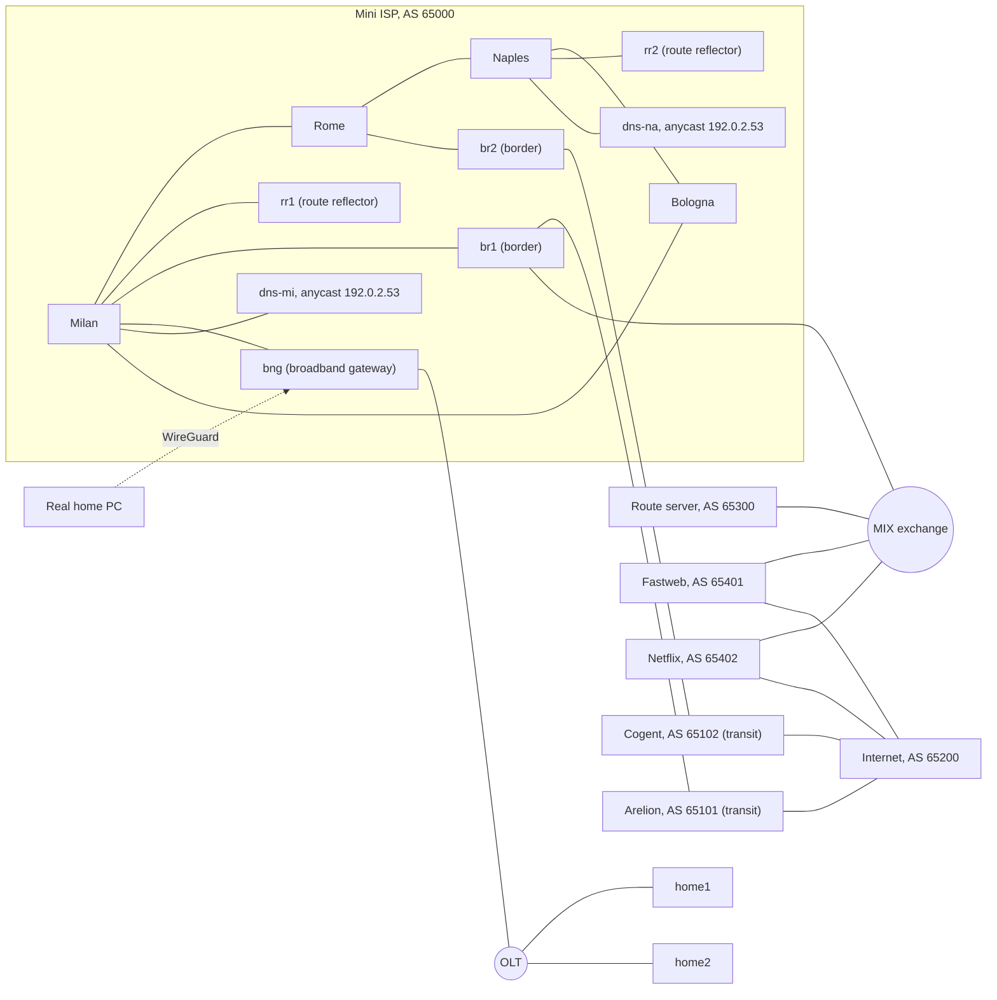

# Mini ISP: a virtual Italian service provider network

[](https://github.com/ahmed-touseef/mini-isp/actions/workflows/ci.yml)

A service provider network built as code with [containerlab](https://containerlab.dev) and [FRRouting](https://frrouting.org), running on a Hetzner cloud server. Fifteen routers form a complete ISP: an IS-IS backbone with Segment Routing MPLS and BFD, iBGP with route reflectors, two transit providers, and peering at an internet exchange. The whole network is defined in text files, rebuilt with one command, and checked by automated test scripts.

## Topology



| Role | Devices | Addressing |
|---|---|---|
| Core (IS-IS level 2, iBGP) | milan, rome, naples, bologna | loopbacks 10.255.0.1 to .4, /31 links in 10.0.0.0/24 |
| Route reflectors | rr1, rr2 | 10.255.0.11, 10.255.0.12 |
| Border routers | br1, br2 | 10.255.0.5, 10.255.0.6 |
| Customer pools | one per city | 192.0.2.0/24 split into four /26 |
| Transit links | br1 to Arelion, br2 to Cogent | 10.100.0.0/16 |
| Exchange LAN | br1, route server, peers | 10.200.0.0/24 |
| Access | bng, olt, home1, home2 | loopback 10.255.0.7, homes in 100.64.0.0/24, CGNAT pool 192.0.2.32/28 |
| Anycast DNS | dns-mi, dns-na | loopbacks 10.255.0.8 and .9, shared 192.0.2.53 |

## What has been built

### Phase 1: OSPF core ring
Four routers in a ring running OSPF, with automated tests for adjacencies, reachability and failover. The router opposite Milan is reached over two equal cost paths (ECMP).

### Phase 2: live migration from OSPF to IS-IS
Most large ISPs run IS-IS in their backbone, so the core was migrated the way an operator would do it in production. IS-IS was enabled alongside OSPF (administrative distance 115 against 110, so it stayed on standby while being verified), then OSPF was removed and IS-IS took over with no traffic loss.

**Fast convergence.** FRR's default timers throttle LSP generation for up to 30 seconds. Tuning `lsp-gen-interval` and `spf-interval` gave:

| Event | Default timers | Tuned timers |
|---|---|---|
| Lab boot until all routes installed | 30 s | **3 s** |
| Link failure until traffic rerouted | 23 s | **2 s** |

### Phase 3a: iBGP with redundant route reflectors
Each city announces its customer pool into BGP. Two route reflectors on opposite sides of the ring remove the need for a full mesh. BGP next hops are router loopbacks, resolved recursively through IS-IS, so BGP decides where traffic goes and IS-IS decides how it gets there. Shutting down one route reflector entirely causes no loss of routes or traffic.

### Phase 3b: internet edge
Two border routers connect to two transit providers over eBGP, with `next-hop-self` towards the core. Outbound filtering announces only the 192.0.2.0/24 aggregate, so the network can never leak one provider's routes to the other and become accidental transit.

### Phase 3c: routing policy
| Goal | Mechanism |
|---|---|
| Send outbound traffic via the preferred provider | local preference 200 on Arelion, 100 on Cogent |
| Pull inbound traffic onto the same provider (fixing asymmetric routing) | AS path prepending towards Cogent |
| Reject bogons, hijacks of our own space, prefixes longer than /24 and default routes | inbound route maps on every eBGP session |
| Survive a misbehaving neighbour | max prefix limits |

The test script makes the simulated internet announce a private prefix, a more specific hijack of a customer pool and a /28. All three are received and all three are blocked.

### Phase 3d: peering at an internet exchange
A simulated MIX exchange with a transparent route server (it keeps the original next hop and does not insert its own AS). Peering routes get local preference 300, giving the classic hierarchy **peering > preferred transit > backup transit**. Traffic to peers goes directly across the exchange in 2 hops instead of 4 through transit. An AS path filter accepts only routes originated by the peer itself: when a peer deliberately leaks its transit routes, they are rejected.

### Phase 4a: MPLS with Segment Routing
IS-IS carries Segment Routing labels: every router has a node SID (16000 plus its index) and FRR allocates an adjacency SID for every link. Customer and internet traffic is label switched: Milan reaches the Naples pool with label 16003, and traffic towards the internet carries the label of its exit border router. MPLS is enabled only on internal interfaces, so no labels are accepted from transit providers or the exchange.

**Kernel finding.** On Linux 7.0, MPLS label routes with more than one next hop are installed as `dead linkdown` and drop traffic. This was confirmed with a label route created by hand with `ip`, without FRR involved. Two changes work around it: `no zebra nexthop kernel enable`, which fixes ECMP for IP routes entering the MPLS network, and a deliberate IS-IS metric of 15 on the Bologna to Milan link, so that no equal cost paths exist in the label table.

### Phase 4b: BFD
BFD at 100 ms × 3 on every internal IS-IS link. Test: a silent failure where every packet on the Milan to Rome link is dropped (netem) while both interfaces stay up.

| Silent failure on Milan to Rome | Detection and reroute |
|---|---|
| IS-IS hellos only | 28,883 ms |
| With BFD | **337 ms** |

### Phase 4c: TI-LFA, measured and rejected
TI-LFA computed correct repair paths (for example, Rome protected via Bologna with label 16002). Traffic loss was measured with one ping every 10 ms while the Milan to Rome link went down:

| Link down on Milan to Rome | Traffic lost |
|---|---|
| Without TI-LFA | 180 ms |
| With TI-LFA | 990 ms |
| With TI-LFA, IS-IS process frozen on Milan | 3,990 ms (everything after the cut) |

Freezing IS-IS proved that the kernel never used the precomputed backup: Linux has no backup next hop concept, so the repair path exists only in FRR's own table. Computing backups also added SPF work, which pushed normal recovery into the SPF throttle window. On carrier routers the backup is programmed into the forwarding hardware and switches in under 50 ms; in this Linux lab TI-LFA was disabled. [`phase4c-tilfa.sh`](phase4c-tilfa.sh) is kept as a record of the experiment.

### Phase 5a: access network
A BNG (broadband network gateway) attached to Milan serves homes through an OLT, simulated as a Linux bridge. Homes get addresses from 100.64.0.0/24 by DHCP (dnsmasq). The BNG is a full backbone router: IS-IS, Segment Routing (node SID 16007), BFD and iBGP.

### Phase 5b: CGNAT
nftables on the BNG translates 100.64.0.0/16 (RFC 6598 shared address space) to the public pool 192.0.2.33 to 192.0.2.46, with `persistent` so each home keeps the same public address. The pool is announced in BGP as a more specific /28. Unsolicited traffic from the internet is dropped, and the BNG's connection tracking table shows which subscriber used which public address, as needed for legal traceability.

### Phase 5c: anycast DNS
Two Unbound resolvers, one behind Milan and one behind Naples, share 192.0.2.53 and announce it in iBGP; DHCP hands it to homes. Every client reaches its nearest resolver, and a `whoami.lab` record shows which one answered. When the Milan resolver loses its link, the BNG switches to Naples in about 270 ms.

Two lab findings were fixed along the way:
- Docker bind-mounts `/etc/resolv.conf`, so the stock DHCP client script, which renames a temporary file over it, could not apply the DNS server. A small hook ([`configs/udhcpc.sh`](configs/udhcpc.sh)) writes it in place.
- With FRR's traditional defaults, BGP next hops may resolve via the default route. Every container has a Docker management default route, so a dead next hop stayed "valid" and customer traffic leaked into the management network. `no ip nht resolve-via-default` on every router fixed it. On carrier routers, a management VRF provides this separation.

### Phase 5d: a real home over WireGuard
The BNG terminates WireGuard on UDP 51820, published on the server's public address. A Windows PC at home becomes subscriber 100.64.1.2: behind CGNAT, across the MPLS core, out via Arelion or directly across the exchange, and resolving lab names on the anycast resolver. The tunnel is split, so only lab ranges use it. Keys live in `secrets/`, which is never committed; run `./phase5d-wireguard.sh` to generate your own before deploying.

### Failover results

| Failure | Result |
|---|---|
| Core link cut | rerouted around the ring in 2 s |
| Route reflector down | no routes or traffic lost |
| Preferred transit down | all traffic moved to the backup provider in 2 s |
| Exchange session down | peer traffic fell back to transit in 1 s |
| Core link down, measured with 10 ms pings | 180 ms of traffic loss |
| Silent core link failure, detected by BFD | 360 ms of traffic loss |
| Anycast DNS server lost | queries moved to the other resolver in about 270 ms |

## Run it yourself

Requires a Linux host with about 2 GB of free RAM.

```bash
git clone https://github.com/ahmed-touseef/mini-isp.git
cd mini-isp
sudo ./setup.sh                                    # installs Docker and containerlab if missing
./phase5d-wireguard.sh                              # generates your own WireGuard keys into secrets/
sudo containerlab deploy -t mini-iliad.clab.yml    # builds all 15 routers
sudo ./verify.sh                                   # IS-IS core
sudo ./verify-bgp.sh                               # iBGP and route reflectors
sudo ./verify-edge.sh                              # transit edge
sudo ./verify-policy.sh                            # routing policy and filtering
sudo ./verify-ix.sh                                # internet exchange peering
sudo ./verify-sr.sh                                # segment routing labels
sudo ./verify-bfd.sh                               # silent failure with BFD
sudo ./verify-loss.sh down                         # traffic loss when a core link fails
sudo ./verify-access.sh                            # BNG and DHCP
sudo ./verify-cgnat.sh                             # CGNAT
sudo ./verify-dns.sh                               # anycast DNS and failover
sudo containerlab destroy -t mini-iliad.clab.yml   # removes everything
```

The `phase*.sh` scripts are kept as a record of how each change was made. The configs in `configs/` already contain the final state.

## Lab notes

The documentation ranges 192.0.2.0/24, 198.51.100.0/24 and 203.0.113.0/24 and the benchmarking range 198.18.0.0/15 are bogons on the real internet. This lab uses them as its "public" address space, so they are exempt from the bogon filters. All AS numbers are private; the provider names are only labels.

The host kernel needs the mpls_router, mpls_iptunnel and sch_netem modules; setup.sh loads them.

## Roadmap

- [x] Phase 1: OSPF core ring
- [x] Phase 2: OSPF to IS-IS migration, fast convergence
- [x] Phase 3: iBGP route reflectors, transit edge, routing policy, internet exchange
- [x] Phase 4: SR-MPLS and BFD (silent failure 28.9 s to 0.34 s); TI-LFA measured and rejected on Linux
- [x] Phase 5: BNG with DHCP, CGNAT, anycast DNS, a real home connected over WireGuard
- [ ] Phase 6: NetBox as source of truth, config generation and CI testing with GitHub Actions
- [ ] Phase 7: streaming telemetry with Prometheus and Grafana

## Author

Touseef Ahmed · [www.touseefahmed.com](https://www.touseefahmed.com)
