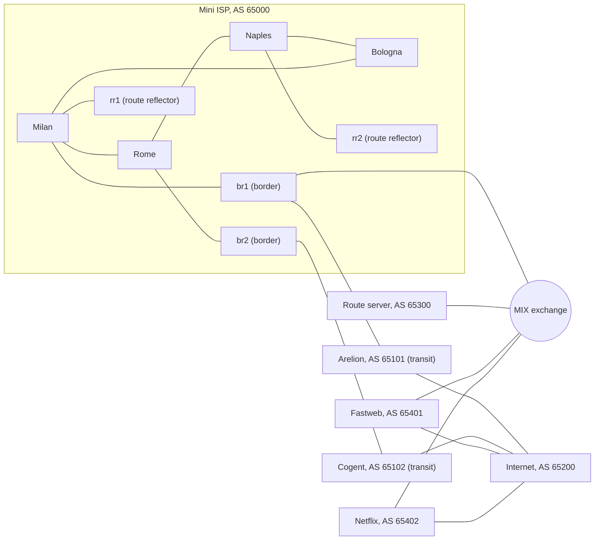

# Mini ISP: a virtual Italian service provider network

A service provider network built as code with [containerlab](https://containerlab.dev) and [FRRouting](https://frrouting.org), running on a Hetzner cloud server. Fifteen routers form a complete ISP: an IS-IS backbone, iBGP with route reflectors, two transit providers, and peering at an internet exchange. The whole network is defined in text files, rebuilt with one command, and checked by automated test scripts.

## Topology



| Role | Devices | Addressing |
|---|---|---|
| Core (IS-IS level 2, iBGP) | milan, rome, naples, bologna | loopbacks 10.255.0.1 to .4, /31 links in 10.0.0.0/24 |
| Route reflectors | rr1, rr2 | 10.255.0.11, 10.255.0.12 |
| Border routers | br1, br2 | 10.255.0.5, 10.255.0.6 |
| Customer pools | one per city | 192.0.2.0/24 split into four /26 |
| Transit links | br1 to Arelion, br2 to Cogent | 10.100.0.0/16 |
| Exchange LAN | br1, route server, peers | 10.200.0.0/24 |

## What has been built

### Phase 1: OSPF core ring
Four routers in a ring running OSPF, with automated tests for adjacencies, reachability and failover. The router opposite Milan is reached over two equal cost paths (ECMP).

### Phase 2: live migration from OSPF to IS-IS
Most large ISPs run IS-IS in their backbone, so the core was migrated the way an operator would do it in production. IS-IS was enabled alongside OSPF (administrative distance 115 against 110, so it stayed on standby while being verified), then OSPF was removed and IS-IS took over with no traffic loss.

**Fast convergence.** FRR's default timers throttle LSP generation for up to 30 seconds. Tuning `lsp-gen-interval` and `spf-interval` gave:

| Event | Default timers | Tuned timers |
|---|---|---|
| Lab boot until all routes installed | 30 s | **3 s** |
| Link failure until traffic rerouted | 23 s | **2 s** |

### Phase 3a: iBGP with redundant route reflectors
Each city announces its customer pool into BGP. Two route reflectors on opposite sides of the ring remove the need for a full mesh. BGP next hops are router loopbacks, resolved recursively through IS-IS, so BGP decides where traffic goes and IS-IS decides how it gets there. Shutting down one route reflector entirely causes no loss of routes or traffic.

### Phase 3b: internet edge
Two border routers connect to two transit providers over eBGP, with `next-hop-self` towards the core. Outbound filtering announces only the 192.0.2.0/24 aggregate, so the network can never leak one provider's routes to the other and become accidental transit.

### Phase 3c: routing policy
| Goal | Mechanism |
|---|---|
| Send outbound traffic via the preferred provider | local preference 200 on Arelion, 100 on Cogent |
| Pull inbound traffic onto the same provider (fixing asymmetric routing) | AS path prepending towards Cogent |
| Reject bogons, hijacks of our own space, prefixes longer than /24 and default routes | inbound route maps on every eBGP session |
| Survive a misbehaving neighbour | max prefix limits |

The test script makes the simulated internet announce a private prefix, a more specific hijack of a customer pool and a /28. All three are received and all three are blocked.

### Phase 3d: peering at an internet exchange
A simulated MIX exchange with a transparent route server (it keeps the original next hop and does not insert its own AS). Peering routes get local preference 300, giving the classic hierarchy **peering > preferred transit > backup transit**. Traffic to peers goes directly across the exchange in 2 hops instead of 4 through transit. An AS path filter accepts only routes originated by the peer itself: when a peer deliberately leaks its transit routes, they are rejected.

### Failover results

| Failure | Result |
|---|---|
| Core link cut | rerouted around the ring in 2 s |
| Route reflector down | no routes or traffic lost |
| Preferred transit down | all traffic moved to the backup provider in 2 s |
| Exchange session down | peer traffic fell back to transit in 1 s |

## Run it yourself

Requires a Linux host with about 2 GB of free RAM.

```bash
git clone https://github.com/ahmed-touseef/mini-isp.git
cd mini-isp
sudo ./setup.sh                                    # installs Docker and containerlab if missing
sudo containerlab deploy -t mini-iliad.clab.yml    # builds all 15 routers
sudo ./verify.sh                                   # IS-IS core
sudo ./verify-bgp.sh                               # iBGP and route reflectors
sudo ./verify-edge.sh                              # transit edge
sudo ./verify-policy.sh                            # routing policy and filtering
sudo ./verify-ix.sh                                # internet exchange peering
sudo containerlab destroy -t mini-iliad.clab.yml   # removes everything
```

The `phase*.sh` scripts are kept as a record of how each change was made. The configs in `configs/` already contain the final state.

## Lab notes

The documentation ranges 192.0.2.0/24, 198.51.100.0/24 and 203.0.113.0/24 and the benchmarking range 198.18.0.0/15 are bogons on the real internet. This lab uses them as its "public" address space, so they are exempt from the bogon filters. All AS numbers are private; the provider names are only labels.

## Roadmap

- [x] Phase 1: OSPF core ring
- [x] Phase 2: OSPF to IS-IS migration, fast convergence
- [x] Phase 3: iBGP route reflectors, transit edge, routing policy, internet exchange
- [ ] Phase 4: MPLS, BFD and TI-LFA for sub second failover
- [ ] Phase 5: customers with DHCP, CGNAT and DNS, plus a real home connection over WireGuard
- [ ] Phase 6: NetBox as source of truth, config generation and CI testing with GitHub Actions
- [ ] Phase 7: streaming telemetry with Prometheus and Grafana

## Author

Touseef Ahmed · [www.touseefahmed.com](https://www.touseefahmed.com)
