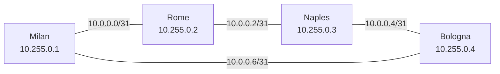

# Mini ISP: a virtual Italian service provider backbone

A service provider network built as code with [containerlab](https://containerlab.dev) and [FRRouting](https://frrouting.org), running on a Hetzner cloud server. The whole network is defined in text files, rebuilt with one command, and checked by an automated test script.

The goal is to reproduce the way a real ISP builds and operates its backbone: an IGP core, a live protocol migration with no downtime, convergence tuning, and then BGP, customers and automation in later phases.

## Topology

Four core routers in a ring, named after Italian cities.



| Router | Loopback | eth1 | eth2 | IS-IS NET |
|---|---|---|---|---|
| milan | 10.255.0.1/32 | 10.0.0.0/31 (to rome) | 10.0.0.7/31 (to bologna) | 49.0001.0102.5500.0001.00 |
| rome | 10.255.0.2/32 | 10.0.0.1/31 (to milan) | 10.0.0.2/31 (to naples) | 49.0001.0102.5500.0002.00 |
| naples | 10.255.0.3/32 | 10.0.0.3/31 (to rome) | 10.0.0.4/31 (to bologna) | 49.0001.0102.5500.0003.00 |
| bologna | 10.255.0.4/32 | 10.0.0.5/31 (to naples) | 10.0.0.6/31 (to milan) | 49.0001.0102.5500.0004.00 |

Point to point links use /31 addressing. The IS-IS system ID is derived from each router's loopback address.

## What has been built so far

### Phase 1: OSPF core ring
Four FRR routers in a ring running OSPF area 0. The test script checks adjacencies, loopback reachability and failover: when the Milan to Rome link is cut, traffic reroutes the long way through Bologna and Naples. Naples, opposite Milan on the ring, is reached over two equal cost paths (ECMP).

### Phase 2: live migration from OSPF to IS-IS with no downtime
Most large ISPs run IS-IS in their backbone, so the core was migrated the way an operator would do it in production ("ships in the night"):

1. IS-IS was enabled alongside OSPF. With administrative distance 115 against OSPF's 110, IS-IS learned every route but stayed on standby while its database and routes were verified.
2. OSPF was removed. The IS-IS routes already in the routing table took over immediately.
3. The lab was destroyed and rebuilt from the saved configs to prove the change is permanent.

The migration is scripted in [`phase2-isis.sh`](phase2-isis.sh).

### Fast convergence
With FRR's default IS-IS timers, LSP generation is throttled for up to 30 seconds, which is far too slow for a backbone. Tuning `lsp-gen-interval` and `spf-interval` gave these results:

| Event | Default timers | Tuned timers |
|---|---|---|
| Lab boot until all routes installed | 30 s | **3 s** |
| Link failure until traffic rerouted | 23 s | **2 s** |

The times are measured by [`verify.sh`](verify.sh), which waits for routes to be installed in the routing table rather than just for adjacencies to come up.

## Run it yourself

Requires a Linux host with about 1.5 GB of free RAM.

```bash
git clone https://github.com/ahmed-touseef/mini-isp.git
cd mini-isp
sudo ./setup.sh                                    # installs Docker and containerlab if missing
sudo containerlab deploy -t mini-iliad.clab.yml    # builds the four router core
sudo ./verify.sh                                   # adjacency, reachability and failover tests
sudo containerlab destroy -t mini-iliad.clab.yml   # removes everything
```

## Repository layout

| Path | Purpose |
|---|---|
| `mini-iliad.clab.yml` | Topology: nodes, links, management network |
| `configs/` | FRR configuration for each router |
| `setup.sh` | Installs Docker and containerlab, checks free memory first |
| `phase2-isis.sh` | Scripted OSPF to IS-IS migration (kept as a record of Phase 2) |
| `verify.sh` | Automated tests with convergence timing |

## Roadmap

- [x] Phase 1: OSPF core ring
- [x] Phase 2: OSPF to IS-IS migration with no downtime, fast convergence
- [ ] Phase 3: iBGP with route reflectors, eBGP to two simulated upstreams and an internet exchange
- [ ] Phase 4: MPLS, BFD and TI-LFA for sub second failover
- [ ] Phase 5: customers with DHCP, CGNAT and DNS, plus a real home connection over WireGuard
- [ ] Phase 6: NetBox as source of truth, config generation and CI testing with GitHub Actions
- [ ] Phase 7: streaming telemetry with Prometheus and Grafana

## Author

Touseef Ahmed · [www.touseefahmed.com](https://www.touseefahmed.com)
